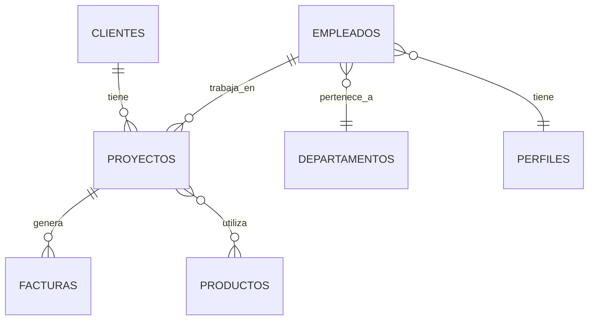

# 🏢 EmpresaCore Manager

[](https://www.oracle.com/java/)
[](https://maven.apache.org/)
[](https://hibernate.org/)
[](https://www.mysql.com/)
[](https://www.oracle.com/java/technologies/persistence-jsp.html)

## 📋 Tabla de Contenidos

- [🎯 Descripción del Proyecto](#-descripción-del-proyecto)
- [✨ Características Principales](#-características-principales)
- [🏗️ Arquitectura y Tecnologías](#️-arquitectura-y-tecnologías)
- [📁 Estructura del Proyecto](#-estructura-del-proyecto)
- [🔧 Instalación y Configuración](#-instalación-y-configuración)
- [📊 Módulos del Sistema](#-módulos-del-sistema)
- [🚀 Uso del Sistema](#-uso-del-sistema)
- [🧪 Testing](#-testing)
- [📈 Diagramas](#-diagramas)
- [🤝 Contribución](#-contribución)

## 🎯 Descripción del Proyecto

**EmpresaCore Manager** es un sistema integral de gestión empresarial desarrollado en Java que permite administrar de manera eficiente los recursos y procesos clave de una organización. El sistema está diseñado siguiendo patrones de arquitectura empresarial y buenas prácticas de desarrollo, implementando el patrón DAO y utilizando JPA/Hibernate para la persistencia de datos.

### 🎯 Objetivo

Proporcionar una solución completa para la gestión de:
- **Clientes**: Administración de información y relaciones comerciales
- **Recursos Humanos**: Gestión de empleados y estructura organizacional
- **Proyectos**: Control y seguimiento de proyectos empresariales
- **Facturación**: Generación y gestión de documentos fiscales

## ✨ Características Principales

- 🔄 **CRUD Completo**: Operaciones Create, Read, Update, Delete para todas las entidades
- 🏛️ **Arquitectura en Capas**: Separación clara entre modelo, acceso a datos y lógica de negocio
- 💾 **Persistencia JPA**: Mapeo objeto-relacional con Hibernate
- 🔍 **Consultas Avanzadas**: Queries personalizadas y métodos de búsqueda específicos
- 📊 **Reportes**: Generación de informes y métricas empresariales
- 🧪 **Testing Integral**: Suite completa de pruebas unitarias
- 📋 **Gestión de Relaciones**: Manejo de relaciones complejas entre entidades

## 🏗️ Arquitectura y Tecnologías

### Stack Tecnológico

| Tecnología | Versión | Propósito |
|------------|---------|-----------|
| **Java** | 17 | Lenguaje de programación principal |
| **Maven** | 3.8+ | Gestión de dependencias y build |
| **Hibernate** | 5.4.11.Final | Framework ORM para persistencia |
| **JPA** | 2.1 | API de persistencia de Java |
| **MySQL** | 8.0+ | Sistema de gestión de base de datos |
| **MySQL Connector** | 8.0.31 | Driver de conexión a MySQL |

### Patrones de Diseño Implementados

- **DAO (Data Access Object)**: Abstracción del acceso a datos
- **Repository Pattern**: Encapsulación de la lógica de consultas
- **Factory Pattern**: Creación de objetos DAO
- **Template Method**: Implementación base común para DAOs

## 📁 Estructura del Proyecto

```
EmpresaCore-Manager/
├── 📁 BBDD/
│   └── BBDD_Proyecto_final.sql          # Script de creación de base de datos
├── 📁 src/
│   ├── 📁 main/
│   │   └── 📁 resources/
│   │       └── 📁 META-INF/
│   │           └── persistence.xml       # Configuración JPA
│   ├── 📁 modelo/
│   │   ├── 📁 dao/                      # Capa de acceso a datos
│   │   │   ├── AbstractDaoImplMy8Jpa.java
│   │   │   ├── IntGenericoCrud.java
│   │   │   └── [Entidad]Dao*.java
│   │   └── 📁 entidades/                # Entidades del modelo
│   │       ├── Cliente.java
│   │       ├── Departamento.java
│   │       ├── Empleado.java
│   │       ├── Factura.java
│   │       ├── Perfil.java
│   │       ├── Producto.java
│   │       ├── Proyecto.java
│   │       └── ProyectoConEmpleado.java
│   ├── 📁 principales/                  # Clases principales de ejecución
│   │   ├── GestionClientes.java
│   │   └── ImprimirFactura.java
│   └── 📁 test/                        # Suite de pruebas
│       ├── 📁 daos/                    # Tests de capa DAO
│       └── 📁 entities/                # Tests de entidades
└── 📁 target/                          # Archivos compilados
```

## 🔧 Instalación y Configuración

### Prerrequisitos

- ☕ **Java 17** o superior
- 🔧 **Maven 3.8+**
- 🗄️ **MySQL 8.0+**
- 💻 **IDE** compatible con Java (IntelliJ IDEA, Eclipse, VS Code)

### Pasos de Instalación

1. **Clonar el repositorio**
   ```bash
   git clone [URL_DEL_REPOSITORIO]
   cd EmpresaCore-Manager
   ```

2. **Configurar la base de datos**
   ```sql
   -- Ejecutar el script SQL
   mysql -u root -p < BBDD/BBDD_Proyecto_final.sql
   ```

3. **Configurar persistence.xml**
   ```xml
   <!-- Actualizar credenciales en src/main/resources/META-INF/persistence.xml -->
   <property name="javax.persistence.jdbc.user" value="tu_usuario"/>
   <property name="javax.persistence.jdbc.password" value="tu_contraseña"/>
   ```

4. **Compilar y ejecutar**
   ```bash
   mvn clean compile
   mvn exec:java -Dexec.mainClass="principales.GestionClientes"
   ```

## 📊 Módulos del Sistema

### 👥 Gestión de Clientes

Administración completa de la cartera de clientes empresariales.

**Funcionalidades:**
- ✅ Alta, consulta, modificación y eliminación de clientes
- 🔍 Búsqueda por CIF, nombre o criterios específicos
- 📈 Análisis de facturación anual y número de empleados
- 📋 Listado completo y filtrado de clientes

**Entidades principales:**
- `Cliente.java` - Entidad principal con información básica y comercial

### 🏢 Recursos Humanos

Sistema integral para la gestión del capital humano y estructura organizacional.

**Funcionalidades:**
- 👤 Gestión completa de empleados (CRUD)
- 🏗️ Administración de departamentos
- 📊 Consultas por departamento y perfil profesional
- 💰 Cálculo de nóminas y costos salariales
- 📈 Reportes de recursos humanos

**Entidades principales:**
- `Empleado.java` - Información personal y profesional
- `Departamento.java` - Estructura organizacional
- `Perfil.java` - Roles y competencias profesionales

### 🎯 Gestión de Proyectos

Control y seguimiento integral de proyectos empresariales.

**Funcionalidades:**
- 📝 Creación y administración de proyectos
- 👥 Asignación de empleados a proyectos
- 📦 Vinculación de productos y recursos
- 📊 Seguimiento de estado y progreso
- 💼 Consultas por cliente, jefe de proyecto y criterios específicos
- 📈 Métricas y KPIs de proyectos

**Entidades principales:**
- `Proyecto.java` - Información del proyecto
- `ProyectoConEmpleado.java` - Relación proyecto-empleado
- `ProyectoConProducto.java` - Relación proyecto-producto

### 💰 Sistema de Facturación

Generación y gestión de documentos fiscales y comerciales.

**Funcionalidades:**
- 🧾 Generación automática de facturas
- 🖨️ Impresión y exportación de documentos
- 📊 Vincular facturas con proyectos y clientes
- 💼 Gestión de productos y servicios
- 📈 Reporting financiero

**Entidades principales:**
- `Factura.java` - Documento fiscal
- `Producto.java` - Catálogo de productos y servicios

## 🚀 Uso del Sistema

### Ejecución del Sistema Principal

```bash
# Gestión de Clientes
mvn exec:java -Dexec.mainClass="principales.GestionClientes"

# Impresión de Facturas
mvn exec:java -Dexec.mainClass="principales.ImprimirFactura"
```

### Ejemplos de Uso

#### Gestión de Clientes
```java
// Crear cliente
Cliente cliente = new Cliente("A12345678", "Juan", "Pérez", "Madrid", 1000000.0, 50);

// Operaciones CRUD
ClienteDao clienteDao = new ClienteDaoImplMy8Jpa();
clienteDao.crear(cliente);
Cliente clienteEncontrado = clienteDao.buscarPorId("A12345678");
clienteDao.actualizar(cliente);
clienteDao.eliminar("A12345678");
```

#### Consultas Personalizadas
```java
// Buscar empleados por departamento
List<Empleado> empleados = empleadoDao.buscarEmpleadosPorDepartamento("IT");

// Proyectos por cliente
List<Proyecto> proyectos = proyectoDao.buscarProyectosPorCliente("A12345678");
```

## 🧪 Testing

El proyecto incluye una suite completa de pruebas unitarias organizadas en:

### Estructura de Tests

```
📁 test/
├── 📁 daos/              # Tests de capa de acceso a datos
│   ├── TestClienteDao.java
│   ├── TestEmpleadoDao.java
│   ├── TestProyectoDao.java
│   └── [...]
└── 📁 entities/          # Tests de entidades del modelo
    ├── TestEmpleado.java
    ├── TestProyecto.java
    └── [...]
```

### Ejecutar Tests

```bash
# Ejecutar todos los tests
mvn test

# Ejecutar tests específicos
mvn test -Dtest=TestClienteDao
mvn test -Dtest=TestEmpleado
```

## 📈 Diagramas

### Modelo de Datos



### Arquitectura del Sistema

```
┌─────────────────────────────────────┐
│          CAPA DE PRESENTACIÓN       │
│     (GestionClientes.java)          │
└─────────────────┬───────────────────┘
                  │
┌─────────────────▼───────────────────┐
│         CAPA DE LÓGICA DE NEGOCIO   │
│          (Clases Principales)       │
└─────────────────┬───────────────────┘
                  │
┌─────────────────▼───────────────────┐
│         CAPA DE ACCESO A DATOS      │
│            (DAOs + JPA)             │
└─────────────────┬───────────────────┘
                  │
┌─────────────────▼───────────────────┐
│         CAPA DE PERSISTENCIA        │
│            (MySQL Database)         │
└─────────────────────────────────────┘
```

## 🤝 Contribución

¡Las contribuciones son bienvenidas! Si deseas contribuir al proyecto:

1. 🍴 **Fork** el repositorio
2. 🌿 **Crea una rama** para tu funcionalidad (`git checkout -b feature/nueva-funcionalidad`)
3. 💾 **Commit** tus cambios (`git commit -am 'Agregar nueva funcionalidad'`)
4. 📤 **Push** a la rama (`git push origin feature/nueva-funcionalidad`)
5. 🔄 **Crea un Pull Request**

### Convenciones de Código

- Utilizar **camelCase** para variables y métodos
- Utilizar **PascalCase** para clases
- Documentar métodos públicos con **JavaDoc**
- Seguir principios **SOLID**
- Mantener **alta cohesión** y **bajo acoplamiento**

## 📄 Licencia

Este proyecto está bajo la Licencia MIT - ver el archivo [LICENSE](LICENSE) para detalles

### 🏆 Contribuciones

- **Architecture Design**: Diseño de la arquitectura del sistema y patrones de diseño implementados
- **Database Modeling**: Modelado de base de datos y optimización de consultas
- **Backend Development**: Implementación de la lógica de negocio y capa de acceso a datos
- **Testing Suite**: Desarrollo de suite completa de pruebas unitarias e integración
- **Documentation**: Documentación técnica y guías de usuario

---

**Desarrollado con ❤️ para la gestión empresarial moderna**

*¿Te interesa el proyecto? ¡Dale una ⭐ al repositorio!*

</div>

---

<div align="center">
  
### 🔗 Enlaces de Interés

[](https://tu-portfolio.com)
[](https://www.linkedin.com/in/deiviperdomo/)
[](https://github.com/deperdomo)

**📅 Última actualización:** Junio 2024
**🎓 Proyecto Académico:** 2º DAW - Entorno Servidor
**🏫 Centro:** IFP - Instituto de Formación Profesional

</div>
